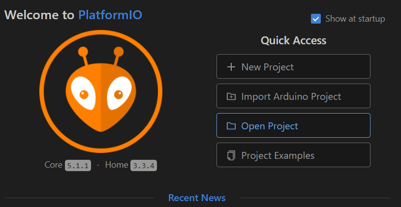
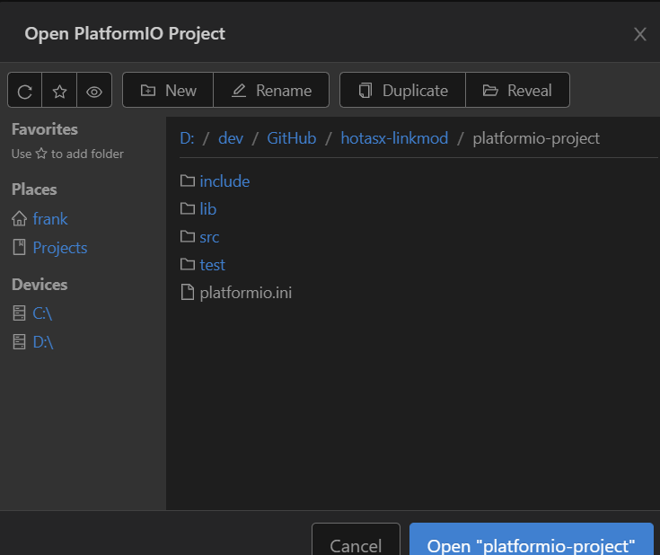

# hotasx-linkmod 

# Table of contents

- [hotasx-linkmod](#hotasx-linkmod)
- [Table of contents](#table-of-contents)
  - [Description/Beschreibung](#descriptionbeschreibung)
  - [Hardware](#hardware)
  - [Software](#software)
- [Environment](#environment)
  - [Howto Build the Project](#howto-build-the-project)

## Description/Beschreibung

## Hardware

* ESP32 "Dev Kit" (az-delivery-devkit-v4) Why? I allready had one left from another project, and didnt want to buy another controller. As most others are using an Arduino Micro Pro I would suggest that you take a look on that one, too.
* Thrustmaster Hotas X (which I got as present on XMas). Throttle and Joystick can be attached together, thats why everyone has instant the idea to print something in between with a 3D printer
* Switches MTS-213-A1 -> This switches have one direction switched, the other direction is like a button. This would help if the switch isnt synced with the game anymore.
* Buttons (sorry for link into a shop, isnt an afiliate link) like https://www.pollin.de/p/drucktaster-rot-oe-17-5mm-36v-1a-1-polig-schliesser-loetanschluss-421052 This buttons have a good haptic when pressing, remembers a bit to a cherry keyboard.
* JOY-IT Joystick Module

## Software

Using VSCode with installed Platform IO Extension for development.
PlatformIO supports the Arduino Framework which makes it more easy to access allready supported devices.

* https://code.visualstudio.com/
* https://platformio.org/
  
 
# Environment 

Please use https://platformio.org/ or https://docs.platformio.org/en/latest/projectconf/index.html for detailed descriptions. For this project so far just the info, that it will have multiple environments configured, depending for developer and connection. In platformio.ini the root section [env] configures all default parts of environments. In the sections like [env:hugin] the specialized settings are configured. This makes it more easy to switch between different serial ports, but change common parts in [env].

## Howto Build the Project

After cloning the repository you can open the platformio-project folder as a project:

Once the project opened one way to use Platform IO environment is using the taskbar:

Right from the GIT symbols the Platform IO Icons are shown.
* House: Go to PlatformIO home (opening projects, search libraries etc)
* Checkmark: Compile current project using selected Environment 
* Arrow: Compile current project and upload to ESP using selected Environment  
* Trashcan: Clean current Project
* Connector Plug: Show ESP Serial Monitor interface
* Square: Open Terminal (less used)
* Folder Symbol with env:environmentname: Select active environment (upload via COMx ... )
