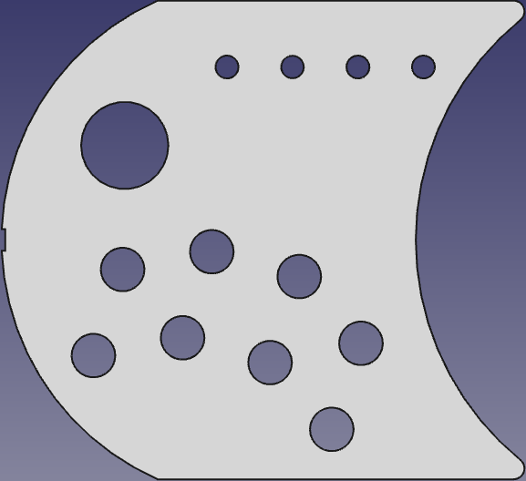
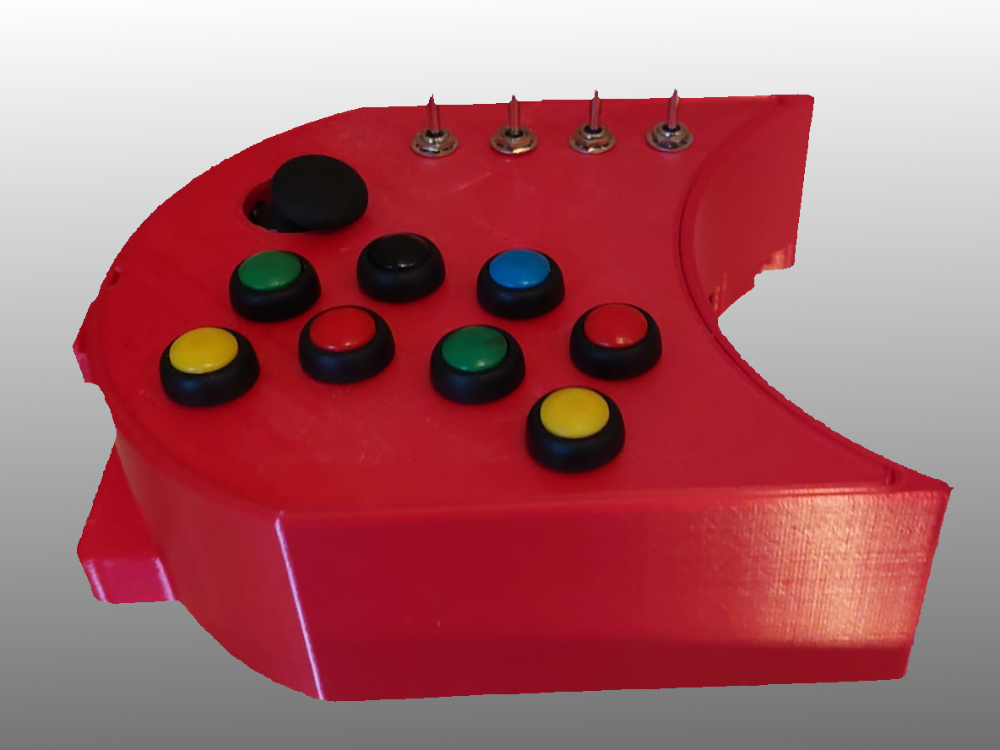
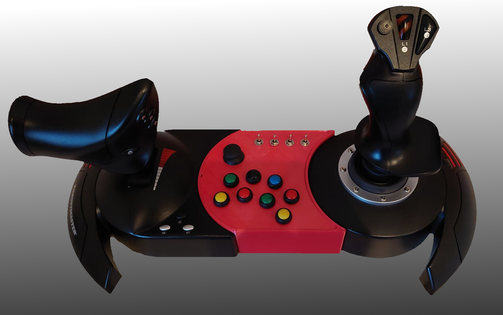
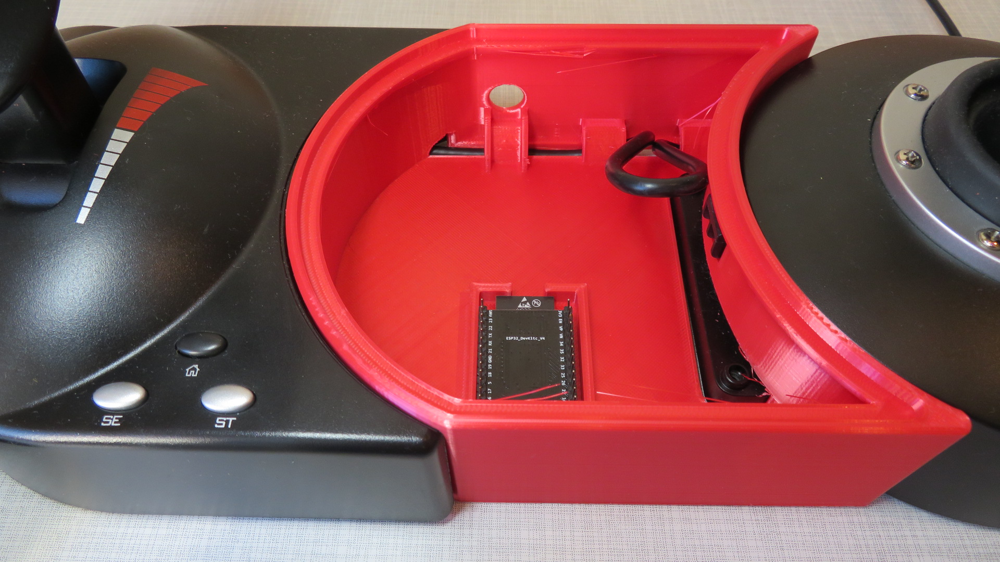
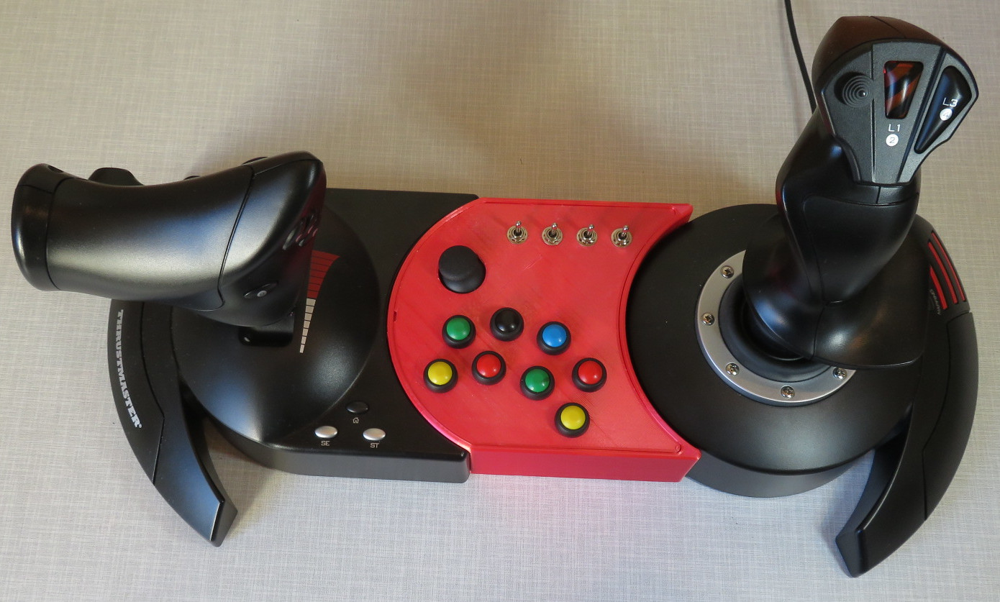
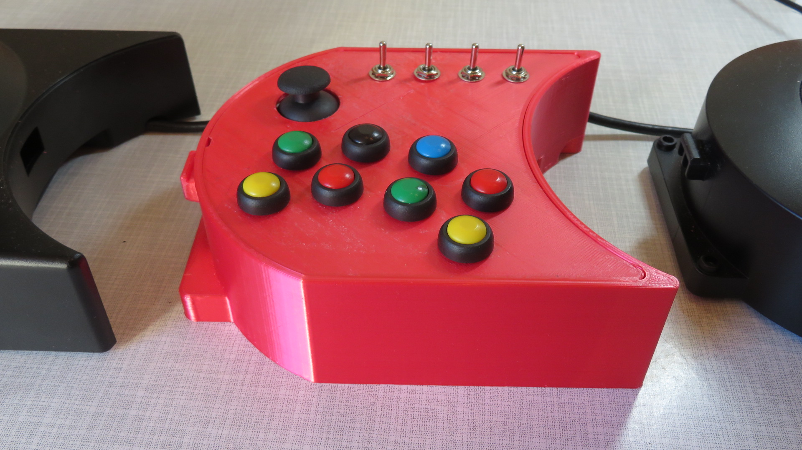
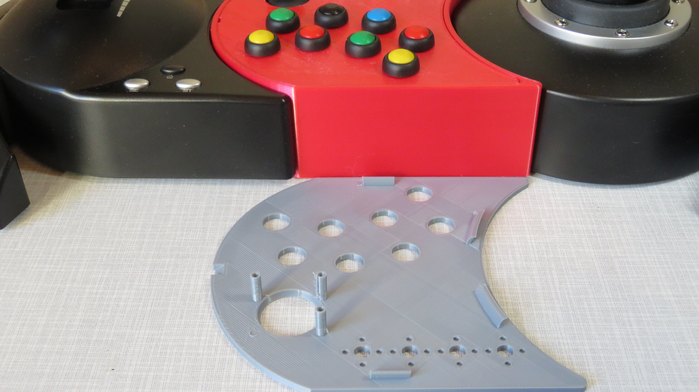
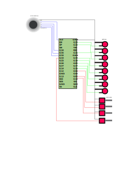

# hotasx-linkmod 

# Table of contents

- [hotasx-linkmod !ESPBuildBadge](#hotasx-linkmod-)
- [Table of contents](#table-of-contents)
  - [Description/Beschreibung](#descriptionbeschreibung)
  - [What is it](#what-is-it)
    - [Features](#features)
  - [Hardware](#hardware)
    - [3DFiles](#3dfiles)
    - [Wiring](#wiring)
  - [Software](#software)
- [Environment](#environment)

## Description/Beschreibung

## What is it

This project is an extension to the Thrustmaster HotasX Joystick. As this joystick can connect the thrust module to the joystick everyone has as first the idea to build a link in between. There are allready some projects on thingiverse, but as I wanted to learn a bit, this project started. 
It contains the Freecad files for the case, as well as the STL files. Feel free to mod it to your belongings. Would appreciate, if you change something, to send an info to me what and how. Since there are many ideas about the top cover design, I could merge them into this repository, link to your repo or maye we can make a branch here for the mod mod.

Update: The linkmod is in use with elite dangerous and working as expected! Yes, I finished a project, such a good feeling.

### Features

* Connectable without skrews
* Open and close wihtout skrews (clippable)
* place for small powerbank
* hole for external powerbank or direct usb connection
* Bluetooth gamepad HID device
* 2 axis Joystick
* 8 Button
* 4 Switches (layout is button / off / switch)

Some pictures to give an idea

## Hardware

* ESP32 "Dev Kit" (az-delivery-devkit-v4) Why? I allready had one left from another project, and didnt want to buy another controller. As most others are using an Arduino Micro Pro I would suggest that you take a look on that one, too.
* Thrustmaster Hotas X (which I got as present on XMas). Throttle and Joystick can be attached together, thats why everyone has instant the idea to print something in between with a 3D printer
* Switches MTS-213-A1 -> This switches have one direction switched, the other direction is like a button. This would help if the switch isnt synced with the game anymore.
* Buttons (sorry for link into a shop, isnt an afiliate link) like https://www.pollin.de/p/drucktaster-rot-oe-17-5mm-36v-1a-1-polig-schliesser-loetanschluss-421052 This buttons have a good haptic when pressing, remembers a bit to a cherry keyboard.
* JOY-IT Joystick Module
* and of course, as you whish to attach, the Hotas X itself.

### 3DFiles

Take a look into [Freecad and STL Folders for the case files](case)

### Wiring

## Software

Using VSCode with installed Platform IO Extension for development.
PlatformIO supports the Arduino Framework which makes it more easy to access allready supported devices.

* https://code.visualstudio.com/
* https://platformio.org/
  
# Environment 

Please use https://platformio.org/ or https://docs.platformio.org/en/latest/projectconf/index.html for detailed descriptions. For this project so far just the info, that it will have multiple environments configured, depending for developer and connection. In platformio.ini the root section [env] configures all default parts of environments. In the sections like [env:hugin] the specialized settings are configured. This makes it more easy to switch between different serial ports, but change common parts in [env].

[Some hints how to build are here](doc/Build.md)
