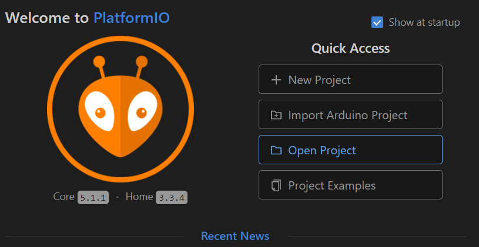

# hotasx-linkmod 

## Howto Build the Project

After cloning the repository you can open the platformio-project folder as a project:

Once the project opened one way to use Platform IO environment is using the taskbar:

Right from the GIT symbols the Platform IO Icons are shown.
* House: Go to PlatformIO home (opening projects, search libraries etc)
* Checkmark: Compile current project using selected Environment 
* Arrow: Compile current project and upload to ESP using selected Environment  
* Trashcan: Clean current Project
* Connector Plug: Show ESP Serial Monitor interface
* Square: Open Terminal (less used)
* Folder Symbol with env:environmentname: Select active environment (upload via COMx ... )

